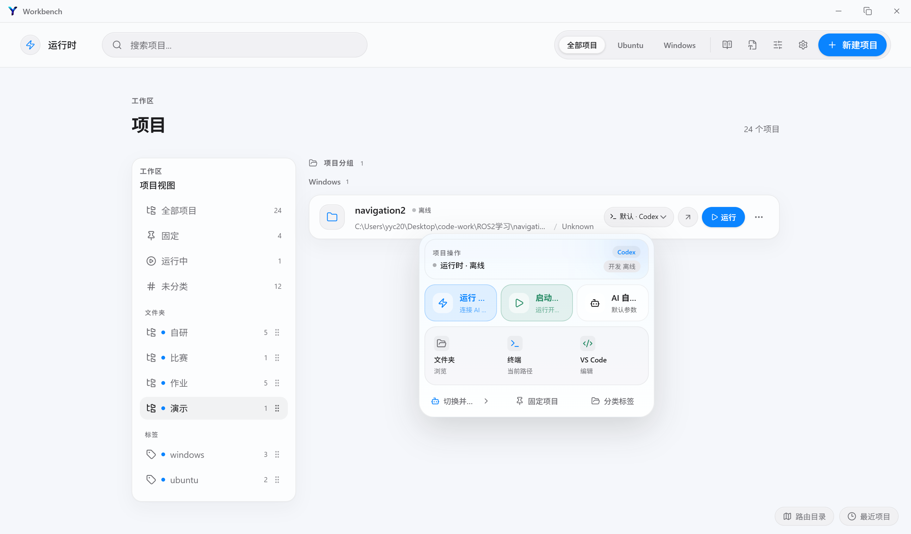
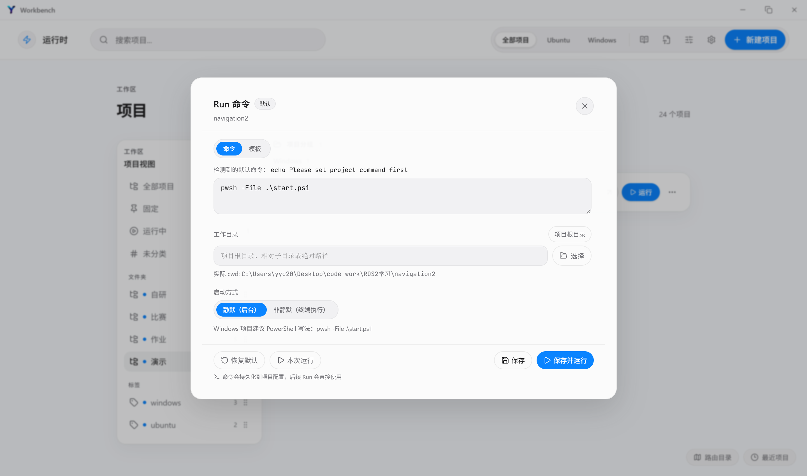
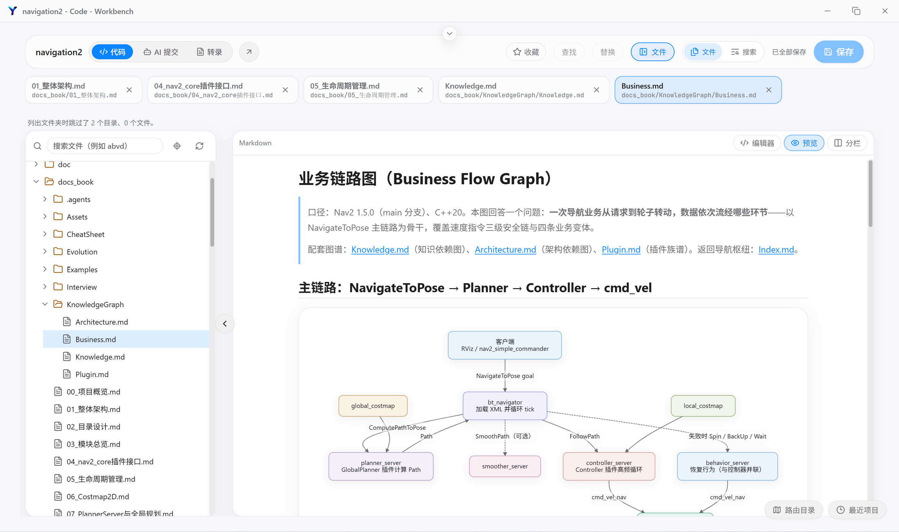
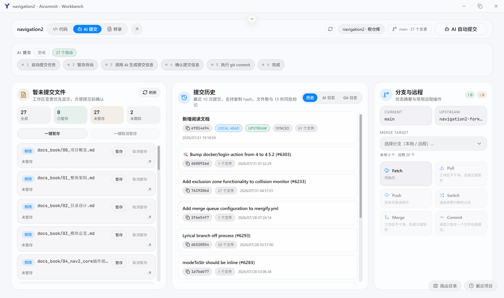
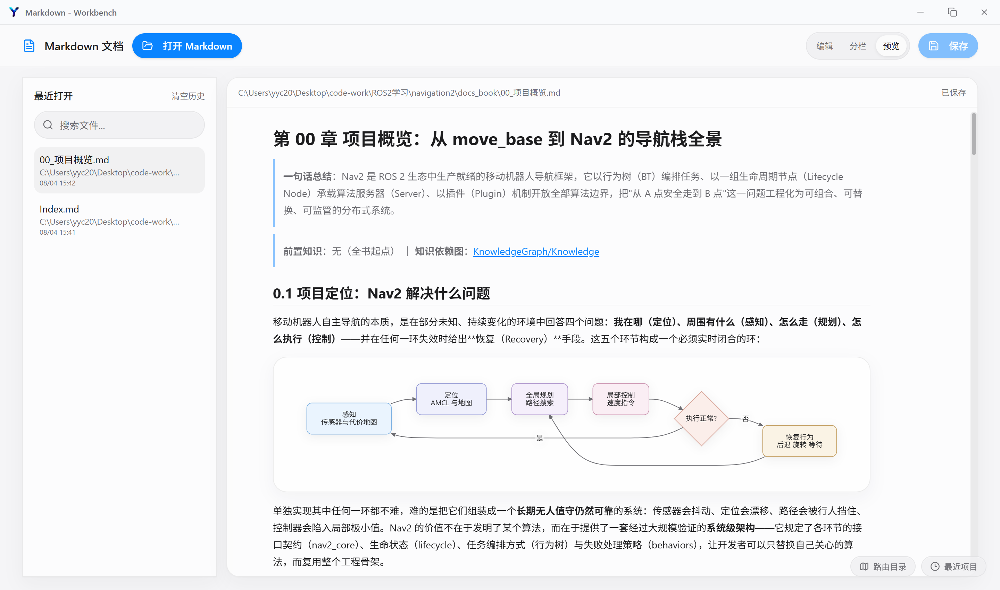
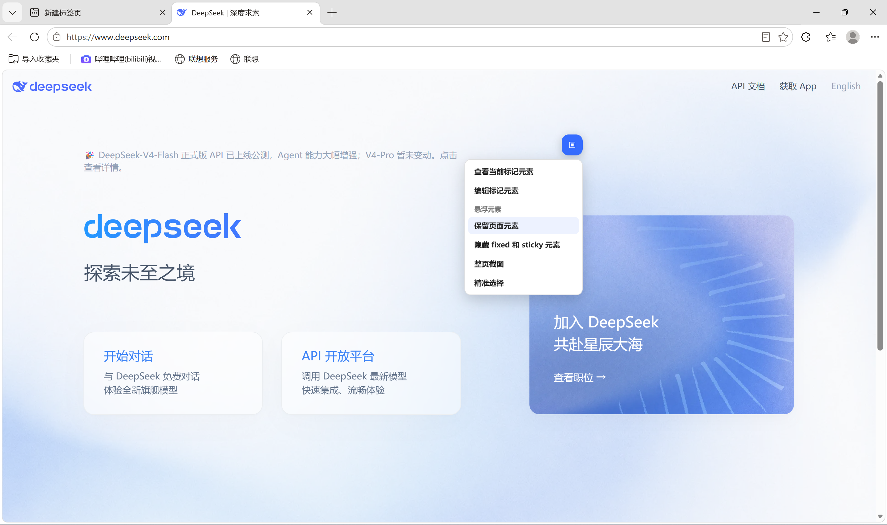
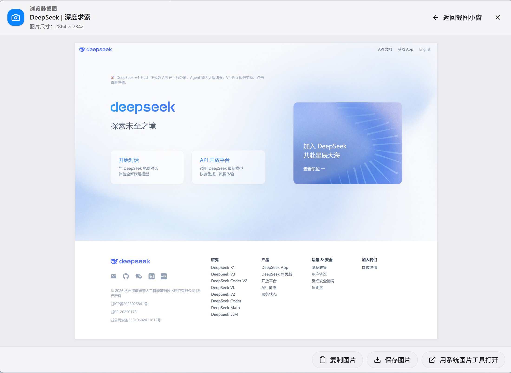
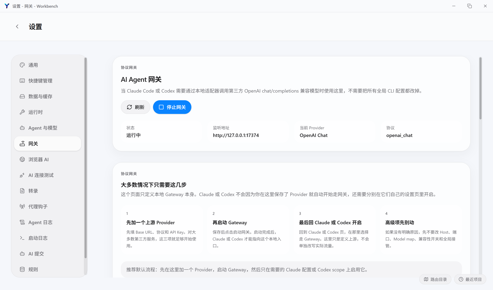
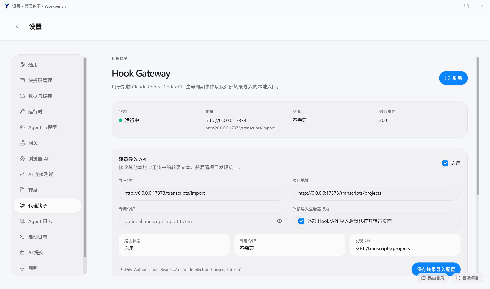

# Workbench

> A local-first Windows desktop workspace for projects, code, Git, AI runtimes, transcripts, and Markdown.

English | [简体中文](./README.md)

Workbench is an Electron-based, local-first desktop workspace for developers who want one focused context for local development and AI-assisted workflows. It brings project navigation, code editing, Git operations, terminal management, local AI CLI runtimes, an AI Gateway, transcript management, learning notes, Markdown documents, and browser screenshots into a single Windows application.

The project is organized around the local project as the primary context. Code, terminals, Git state, AI sessions, and documentation can be accessed from the same workspace, helping developers reduce tool switching and preserve the context of an AI-assisted task.

> Workbench is under active development. Some features and interfaces may change as the project evolves.

## Platform support

Because the project currently has access to a Windows development environment only, we currently provide Windows installation packages exclusively. Windows and WSL are supported at this time. macOS and Linux may potentially work in development mode, but they have not been thoroughly tested, so stability cannot be guaranteed. If possible, we plan to gradually improve and enable support for more platforms in the future.

## Highlights

- 🗂️ **Project workspace** — Add, switch, and manage local projects with recent-project persistence.
- 🧭 **Code workspace** — Browse project trees, edit source files with Monaco, inspect diffs, and preview Markdown.
- 🌿 **Git workflow** — Review repository status, branches, commits, diffs, staging, common operations, and conflicts.
- 🖥️ **Terminals and processes** — Manage interactive terminals and project tasks through node-pty and xterm.js.
- 🤖 **Local AI runtimes** — Configure and run local Claude Code and OpenAI Codex CLI workflows per project.
- 🔌 **AI Gateway** — Centralize providers, model routing, gateway bindings, streaming responses, and protocol compatibility.
- 🧾 **Agent Hooks and transcripts** — Capture agent lifecycle events and import, browse, organize, and share AI CLI transcripts.
- 📚 **Learning center** — Maintain structured notes, categories, skills, and browser-assisted learning material.
- 📝 **Markdown workspace** — Render GFM, syntax-highlighted code, tables, and Mermaid diagrams.
- 📸 **Browser screenshots** — Capture long web pages, handle fixed elements, and inspect or save screenshots in a dedicated window.
- 🪟 **Windows and WSL support** — Keep Windows-native and WSL project execution paths explicit in the runtime model.

## Feature Showcase

### AI Workbench

Workbench provides a unified AI workbench for managing frequently used AI tools, development projects, and working environments. It helps developers enter a productive state quickly without switching between multiple applications.



### One-click Project Startup

Workbench detects startup scripts in project roots and provides one-click project startup. Development services are managed in one place, while multiple projects can be managed at the same time without filling the desktop with terminal windows.



### Integrated Development Workspace

Workbench combines project browsing, file management, code editing, terminals, and Markdown reading in a lightweight integrated workspace. This reduces the need to switch between an IDE, file explorer, terminal, and documentation tools.



### Git Assistant

The built-in Git assistant helps developers generate standardized commit messages and complete common Git operations quickly, reducing repetitive command input for both personal development and team collaboration.



### Markdown Viewer

Workbench can be associated with Markdown files and provides high-quality rendering for README files, project documentation, API documentation, and development notes.



### Browser Integration

After browser configuration, press **Ctrl + Shift + S** to launch a browser quickly. Browser instances are managed by Workbench, providing a consistent entry point for development pages, screenshots, automated testing, and page debugging.



### Browser Screenshots

Workbench supports full-page screenshots and screenshots of selected elements. Captured images can be viewed inside Workbench or opened with the system image viewer for development, testing, documentation, and bug reporting.



### AI Gateway and Protocol Conversion

Workbench includes a local AI Gateway for managing model access configuration and converting between AI service protocols. This provides a consistent calling method across services such as Claude Code and Codex, reducing integration costs and making AI workflows more flexible.



### AI Notifications

Workbench can receive runtime messages from AI coding tools such as Claude Code and Codex. Notifications can be pushed to Feishu on mobile when a task completes, requires confirmation, or encounters an exception, so developers do not need to wait at their computers.



## Architecture

Workbench follows Electron's process boundaries and keeps shared contracts separate from platform capabilities and UI composition.

See the [module and architecture reference](./docs/reference/architecture.md) for product modules, layer responsibilities, and the typical AI workflow.

### Layer responsibilities

- **Renderer** — Pages, reusable components, application state, themes, editors, and user interactions.
- **Preload** — Typed, minimal APIs exposed from the isolated Electron bridge.
- **Main process** — File-system, process, Git, window, runtime, transcript, and Windows integration services.
- **Shared** — Types, configuration models, runtime profiles, IPC contracts, and pure rules shared across layers.

## Tech stack

- **Language:** TypeScript
- **Desktop:** Electron 42
- **UI:** React 18, React Router, Tailwind CSS
- **Build:** Vite, electron-vite, Electron Builder
- **State:** Zustand
- **Editor:** Monaco Editor
- **Terminal:** node-pty, xterm.js
- **Content:** React Markdown, remark-gfm, Mermaid, syntax highlighting
- **AI integrations:** Claude Code and OpenAI Codex CLI workflows, with a local model-protocol gateway
- **Testing:** Node.js built-in test runner

## Product modules

Workbench is more than a collection of separate tools. It organizes the local development process around a project context:

```text
Project
 ├── Code and files
 ├── Git
 ├── Terminals and process tasks
 ├── AI Runtime / AI Gateway
 ├── Agent Hooks / Transcripts
 ├── Markdown documents
 └── Learning material and browser screenshots
```

The [module and architecture reference](./docs/reference/architecture.md) describes each module, its responsibilities, and the boundaries between Renderer, Preload, Main, and Shared layers.

## Requirements

- Windows 10 or later; Windows 11 is recommended
- Node.js 22 LTS or later
- npm
- Git
- Optional: a working WSL distribution for WSL-based projects
- Optional: installed and authenticated AI CLIs for AI runtime features

The built-in runtime profiles currently target:

- [Claude Code](https://www.npmjs.com/package/@anthropic-ai/claude-code)
- [OpenAI Codex CLI](https://www.npmjs.com/package/@openai/codex)

## Installation

Clone the repository and install dependencies:

```powershell
git clone https://github.com/yyc-labs/ide-electron.git
cd ide-electron
npm install
```

The `postinstall` script rebuilds `node-pty` for Electron. If terminal functionality is not available after installation, run:

```powershell
npm run rebuild:pty
```

Install optional AI CLIs when you need them:

```powershell
npm install -g @anthropic-ai/claude-code
npm install -g @openai/codex
```

Complete authentication and API configuration according to the official documentation for each CLI.

## Development

Start the Electron development environment:

```powershell
npm run dev
```

Useful commands:

```powershell
# Start with file watching
npm run dev:watch

# Type-check main and renderer projects
npm run typecheck

# Run repository style checks
npm run check:style

# Run tests
npm test

# Run type-checking, style checks, and tests
npm run verify
```

## Configuration

Workbench stores application and runtime configuration locally. AI credentials, tokens, and provider secrets should be configured through the application or the corresponding CLI; do not commit secrets to the repository.

Runtime configuration can include:

- Windows-native or WSL execution targets
- Project-level AI runtime profiles
- Claude and Codex settings
- AI provider and model routes
- Local gateway settings
- Git and project workspace preferences

Windows-native and WSL are modeled as explicit execution targets. Windows projects use Windows paths and process environments, while WSL projects use the selected distribution's paths and environment. Runtime behavior should not depend on guessing a default backend.

When adding a new configuration option, keep its schema, persistence, IPC contract, and renderer usage synchronized.

## Project structure

```text
.
├── src/core/
│   ├── electron/     # Main process, preload, IPC, runtime, Git, files, and windows
│   ├── renderer/     # React pages, components, stores, editors, and styles
│   └── shared/       # Shared types, rules, runtime profiles, and API contracts
├── docs/             # Architecture notes, design plans, and release documentation
├── script/           # Development, release, and automated Git scripts
├── test/             # Node.js tests and fixtures
├── icon/             # Windows application icons
├── electron-builder.yml
├── package.json
└── README.md
```

For a detailed module map and architecture overview, see [`docs/reference/architecture.md`](./docs/reference/architecture.md).

## Windows distribution

Build the application resources:

```powershell
npm run build
```

Create a Windows x64 NSIS installer:

```powershell
npm run dist:win
```

Release artifacts are written to `release/`. See [`docs/release/release-process.md`](./docs/release/release-process.md) for versioning, checksums, and release notes.

The current installer is not configured with a Windows code-signing certificate, so Windows SmartScreen may show an “unknown publisher” warning during installation.

## Roadmap

The roadmap is maintained alongside implementation plans in [`docs/`](./docs/).

- [x] Local project and code workspace
- [x] Git repository inspection and operations
- [x] Claude and Codex runtime profiles
- [x] AI provider gateway and model routing
- [x] Transcript import and browsing
- [x] Markdown rendering with Mermaid and GFM support
- [x] Browser screenshot capture and viewing
- [x] Terminal and project task management
- [x] Agent Hook Gateway and transcript import
- [x] Learning center and basic skill management
- [ ] Broader platform support beyond Windows
- [ ] More runtime providers and integrations
- [ ] More complete release automation and distribution channels

## Contributing

Contributions, issue reports, and focused improvements are welcome.

1. Fork the repository.
2. Create a feature branch.
3. Make a focused change with tests where appropriate.
4. Run the relevant checks.
5. Open a pull request with context and verification details.

```powershell
git checkout -b feature/your-feature
npm run typecheck
npm test
```

Please preserve the existing process boundaries between `renderer`, `preload`, `main`, and `shared`, and consider both Windows-native and WSL execution paths when changing runtime behavior.

## Security

Please do not include API keys, access tokens, private transcripts, or other sensitive data in issues, pull requests, screenshots, or commits.

For security-sensitive reports, contact the maintainers privately before publishing exploit details. A dedicated security policy will be added as the project moves toward a broader public release.

## License

Workbench is released under the [MIT License](./LICENSE).

Copyright © 2026 YYC Labs.

## Author

**YYC Labs**

- GitHub: [yyc-labs](https://github.com/yyc-labs)
- QQ group: `1095597870`

---
