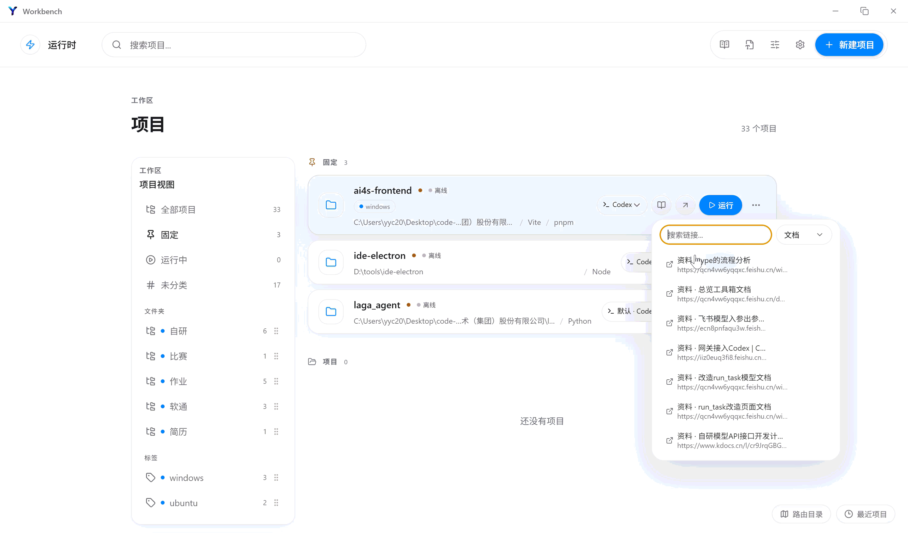
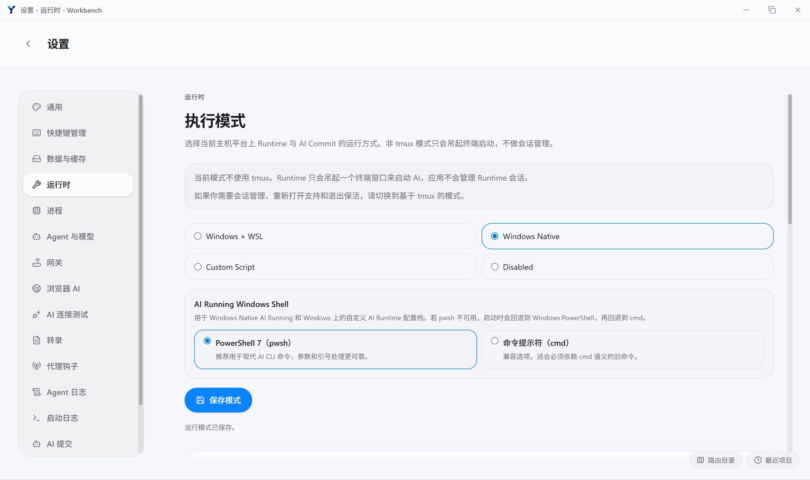
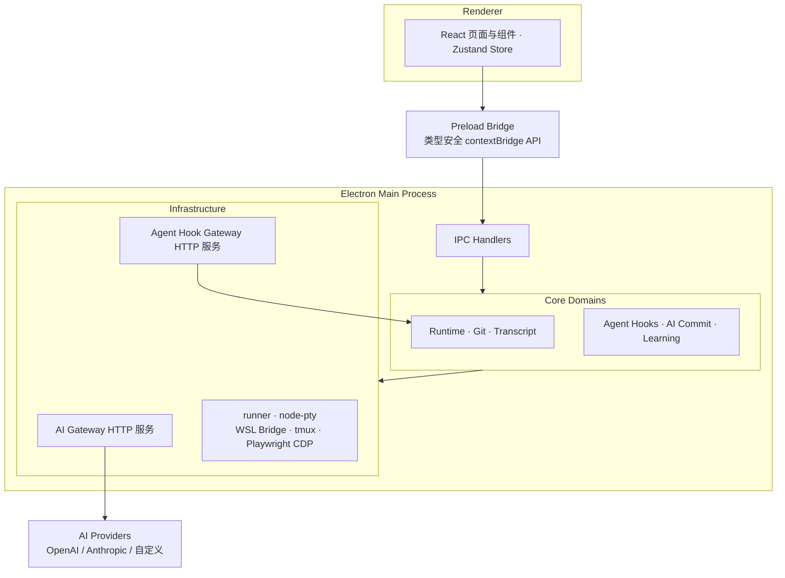

# Workbench

> 为 AI 编程打造的本地开发工作台


  


**Workbench 不替代 Claude Code 或 Codex —— 它为它们提供一个运行的地方。**

它是一个围绕本地项目组织的桌面工作台：AI Agent Runtime、终端、Git、会话记录和文档在同一界面中协作，让 AI 辅助开发拥有一个统一的工作上下文。



[架构文档](./docs/reference/architecture.md) · [Releases](https://github.com/yyc-labs/ide-electron/releases) · [反馈 Issue](https://github.com/yyc-labs/ide-electron/issues)

---

## 什么是 Workbench?

Claude Code、Codex 让 AI 直接参与编码，但它们运行时，你的注意力散落在各个窗口之间：

```text
  终端窗口        编辑器         Git 客户端      文档 / 浏览器
  Agent 输出      查看改动        提交代码        查资料
       ↘             ↓              ↓            ↙
       
                       注意力被反复打断
```

真正的问题不是「窗口太多」，而是：

> **Agent 的工作过程没有统一的工作上下文。**

Agent 改了哪些文件？哪次会话讨论过这个方案？开发服务起来了吗？答案分散在每个工具里。

## Workbench 的答案

**围绕项目组织 AI 编程，而不是围绕终端。**

以「项目」为中心，把 AI 基础设施、开发环境和历史记录收敛到一个桌面应用：

```text
                     Workbench
                         │
       ┌─────────────────┼─────────────────┐
       ↓                 ↓                 ↓
   AI 基础设施        开发工作区          桌面集成
       │                 │                 │
   AI Runtime        编辑器 / 文件       系统托盘
   AI Gateway        终端 / 运行         全局快捷键
   Agent Hooks       Git / 提交         飞书通知
   Transcript        Markdown / 浏览器   多窗口
       │                 │
       └────────┬────────┘
                ↓
           项目 Project
                ↓
         会话与项目历史
```

## 它和 AI Code Editor 有什么不同？

Workbench 不是另一个 Cursor，也不是又一个 AI CLI 封装：

| | AI CLI<br>(Claude Code / Codex) | AI Code Editor<br>(Cursor 等) | Workbench |
| --- | --- | --- | --- |
| 形态 | 终端里的 Agent | 内嵌 AI 的编辑器 | 承载 Agent 的桌面工作台 |
| Agent 在哪运行 | 你自己的终端 | 编辑器内置 | 独立 Runtime + 集成终端 |
| 多个 CLI 共存 | 各自独立 | 通常单一内置 | 同一界面管理 Claude Code 与 Codex |
| 会话沉淀 | 散落的本地文件 | 工具内会话 | Transcript 项目历史 |
| 角色 | 引擎 | 引擎 + 编辑器 | **引擎的运行环境** |

> Workbench does not replace Claude Code or Codex — it gives them a place to run.

---

## 核心能力

### AI 基础设施

**AI Runtime** —— 按项目配置并一键启动本地 AI CLI。Runtime Profile 显式区分 Windows Native 与 WSL 执行路径；Agent 运行在集成终端面板中，支持 tmux 会话恢复、进程状态与运行诊断。



**AI Gateway** —— 一个本地端点，接入所有模型：

```text
Claude Code ── Anthropic 协议 ──┐
Codex CLI ─── OpenAI 协议 ──────┤
                                ↓
                      Workbench AI Gateway
                      Provider 路由 · 模型映射
                      流式响应 · 调用 Trace
                                ↓
                 OpenAI / Anthropic / 自定义 Provider
```

提供 Anthropic Messages、OpenAI Chat Completions、OpenAI Responses 三种协议入口，任意上游协议可转换为工具需要的格式——在 Claude Code、Codex 之间切换模型，无需改动工具配置。


**Agent Hooks + Transcript** —— 把短暂的 Agent 会话变成可回溯的项目历史：

```text
Agent 会话
 ├── 进程输出 / tmux 捕获
 ├── Hook 生命周期事件（会话开始/结束、权限请求等 20+ 种）
 └── 手动 Markdown / 外部文件导入
          ↓
      Transcript
          ↓
    可回溯的项目历史
```

昨天让 Agent 干了什么、改了哪些地方、为什么这么改——按项目回溯，并可生成分享快照。

也可以随时按下 **Ctrl + Shift + L**：Workbench 会向当前聚焦的 Agent 终端粘贴一条提示词，Agent 自动获取 skill、总结本次会话并导入转录库——无需手动整理，每个 Agent 都能自己完成会话沉淀。


配置 Hook 后，任务完成或需要确认时，飞书会实时收到通知。


### 开发工作区

**集成开发工作区** —— 文件树、Monaco 编辑器（TextMate 语法）、Markdown 预览（GFM / Mermaid / 滚动同步），图片、视频、CSV、HTML、PDF 直接预览。


**终端与运行任务** —— 基于 node-pty 与 xterm.js 的交互式终端；自动识别项目启动脚本、一键启动；开发服务统一管理，支持多项目并行。


**Git 与 AI Commit** —— 仓库状态、分支、fetch/pull/push/merge、冲突处理与 diff 审查；AI Commit 基于项目改动生成标准化提交信息，配合可视化 Git 工作流画布。


**浏览器集成与截图** —— Ctrl+Shift+S 启动统一管理的浏览器实例；整页长截图与指定元素截图，独立查看器中缩放浏览、复制或保存。

 

### 桌面集成

系统托盘面板 · 全局快捷键（主题切换 / 会话捕获 / 浏览器截图 / Agent 会话总结）· 开机自启 · 多窗口 · 中英双语 · 深浅色主题

---

## 快速开始

环境要求：Windows 10+（推荐 Windows 11）、Node.js 22 LTS、npm、Git。

```powershell
git clone https://github.com/yyc-labs/ide-electron.git
cd ide-electron
npm install
npm run dev
```

`postinstall` 会为 Electron 重建 `node-pty`；如果安装后终端能力异常，可手动执行 `npm run rebuild:pty`。

> **Workbench 不内置 AI Agent。** 需要使用 AI Runtime 时，单独安装你想使用的 CLI 并按官方文档完成登录：

```powershell
npm install -g @anthropic-ai/claude-code   # 可选
npm install -g @openai/codex               # 可选
```

## 平台支持

Workbench 目前仅提供 **Windows** 安装包，并原生支持 **WSL** 项目（自动探测发行版，在 WSL 内通过 tmux 管理会话）。macOS 与 Linux 尚未经过充分验证，暂不保证稳定性。

## 架构

Workbench 遵循 Electron 进程边界，将共享契约、平台能力和 UI 编排分离：



- **Renderer**：React 页面与组件、应用状态、主题、编辑器与交互
- **Preload**：隔离的 contextBridge，暴露最小化、类型安全的 API
- **Main · Core Domains**：Git、Runtime、Transcript、Hooks、Learning、AI Commit
- **Main · Infrastructure**：AI Gateway、Hook Gateway、node-pty、WSL Bridge、tmux、Playwright
- **Shared**：跨层类型、配置模型、Runtime Profile 与 IPC 契约

**技术栈**：Electron 42 · React 18 · TypeScript · Zustand · Monaco Editor · xterm.js / node-pty · Playwright · Milkdown · Mermaid · pdfjs-dist

完整分层职责与数据流见 [`docs/reference/architecture.md`](./docs/reference/architecture.md)。

## 开发

```powershell
npm run typecheck      # 类型检查
npm run check:style    # 样式检查
npm test               # 运行测试
npm run verify         # 完整验证
```

构建 Windows 安装包：

```powershell
npm run build          # 构建应用资源
npm run dist:win       # 生成 Windows x64 NSIS 安装包
```

构建产物位于 `release/`，发布流程见 [`docs/release/release-process.md`](./docs/release/release-process.md)。当前安装包尚未配置代码签名证书，安装时可能出现 SmartScreen 提示。

## 路线图

**近期**

- 更多 AI Runtime Provider 与集成
- 完善发布自动化与分发渠道

**长期**

- macOS / Linux 平台支持

## 参与贡献

欢迎提交 Issue 和 Pull Request：

1. Fork 仓库并创建功能分支
2. 完成聚焦的代码修改，适当补充测试
3. 运行 `npm run verify` 通过检查
4. 提交 Pull Request 并说明背景和验证结果

修改 Runtime 行为时，请保持 `renderer`、`preload`、`main` 和 `shared` 之间的进程边界，并同时评估 Windows Native 与 WSL 执行路径。

## 安全说明

请勿在 Issue、Pull Request、截图或提交记录中包含 API Key、访问 Token、私人会话记录或其他敏感信息。涉及安全问题时，请在公开披露漏洞细节前先私下联系维护者。

## 许可证

[MIT License](./LICENSE) · Copyright © 2026 YYC Labs

## 作者

**YYC Labs**

- GitHub: [yyc-labs](https://github.com/yyc-labs)
- QQ group: `1095597870`
