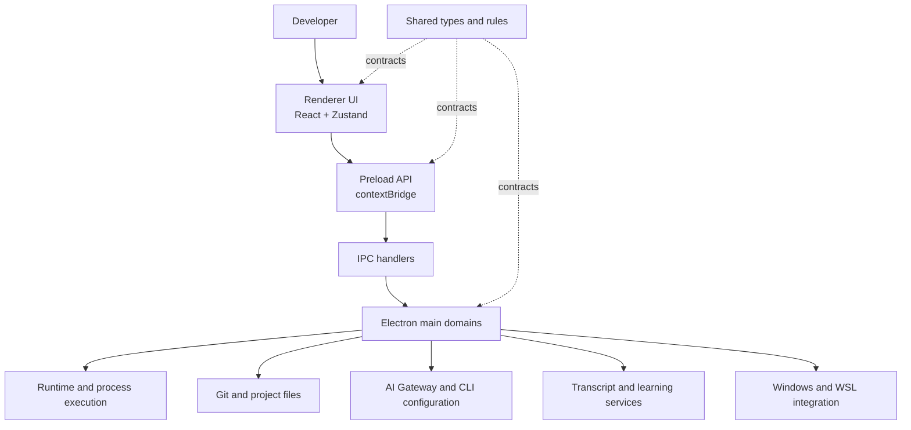

# Workbench

> A local-first Windows desktop workspace for projects, code, Git, AI runtimes, transcripts, and Markdown.

English | [简体中文](./README.zh-CN.md)

Workbench is an Electron-based desktop IDE for developers who want one focused workspace for local development and AI-assisted workflows. It brings project navigation, code browsing, Git operations, local AI CLI runtimes, transcript management, learning notes, Markdown documents, and browser screenshots into a single Windows application.

> Workbench is under active development. Some features and interfaces may change as the project evolves.

## Platform support

Because the project currently has access to a Windows development environment only, we currently provide Windows installation packages exclusively. Windows and WSL are supported at this time. macOS and Linux may potentially work in development mode, but they have not been thoroughly tested, so stability cannot be guaranteed. If possible, we plan to gradually improve and enable support for more platforms in the future.

## Highlights

- 🗂️ **Project workspace** — Add, switch, and manage local projects with recent-project persistence.
- 🧭 **Code workspace** — Browse project trees, edit source files, inspect diffs, and preview Markdown.
- 🌿 **Git workflow** — Review repository status, branches, commits, diffs, staging, common operations, and conflicts.
- 🤖 **Local AI runtimes** — Configure and run local Claude Code and OpenAI Codex CLI workflows per project.
- 🔌 **AI Gateway** — Centralize provider configuration, model routing, and Codex-compatible gateway bindings.
- 🧾 **Transcript workspace** — Import, browse, organize, capture, and share AI CLI session transcripts.
- 📚 **Learning center** — Maintain structured notes, categories, skills, and browser-assisted learning material.
- 📝 **Markdown workspace** — Render GFM, syntax-highlighted code, tables, and Mermaid diagrams.
- 📸 **Browser screenshots** — Capture long web pages, handle fixed elements, and inspect or save screenshots in a dedicated window.
- 🪟 **Windows and WSL support** — Keep Windows-native and WSL project execution paths explicit in the runtime model.

## Screenshots


## Architecture

Workbench follows Electron's process boundaries and keeps shared contracts separate from platform capabilities and UI composition.



### Layer responsibilities

- **Renderer** — Pages, reusable components, application state, themes, editors, and user interactions.
- **Preload** — Typed, minimal APIs exposed from the isolated Electron bridge.
- **Main process** — File-system, process, Git, window, runtime, transcript, and Windows integration services.
- **Shared** — Types, configuration models, runtime profiles, IPC contracts, and pure rules shared across layers.

## Tech stack

- **Language:** TypeScript
- **Desktop:** Electron 42
- **UI:** React 18, React Router, Tailwind CSS
- **Build:** Vite, electron-vite, Electron Builder
- **State:** Zustand
- **Editor:** Monaco Editor
- **Terminal:** node-pty, xterm.js
- **Content:** React Markdown, remark-gfm, Mermaid, syntax highlighting
- **AI integrations:** Claude Code and OpenAI Codex CLI workflows, with a local model-protocol gateway
- **Testing:** Node.js built-in test runner

## Requirements

- Windows 10 or later; Windows 11 is recommended
- Node.js 22 LTS or later
- npm
- Git
- Optional: a working WSL distribution for WSL-based projects
- Optional: installed and authenticated AI CLIs for AI runtime features

The built-in runtime profiles currently target:

- [Claude Code](https://www.npmjs.com/package/@anthropic-ai/claude-code)
- [OpenAI Codex CLI](https://www.npmjs.com/package/@openai/codex)

## Installation

Clone the repository and install dependencies:

```powershell
git clone https://github.com/yyc-labs/ide-electron.git
cd ide-electron
npm install
```

The `postinstall` script rebuilds `node-pty` for Electron. If terminal functionality is not available after installation, run:

```powershell
npm run rebuild:pty
```

Install optional AI CLIs when you need them:

```powershell
npm install -g @anthropic-ai/claude-code
npm install -g @openai/codex
```

Complete authentication and API configuration according to the official documentation for each CLI.

## Development

Start the Electron development environment:

```powershell
npm run dev
```

Useful commands:

```powershell
# Start with file watching
npm run dev:watch

# Type-check main and renderer projects
npm run typecheck

# Run repository style checks
npm run check:style

# Run tests
npm test

# Run type-checking, style checks, and tests
npm run verify
```

## Configuration

Workbench stores application and runtime configuration locally. AI credentials, tokens, and provider secrets should be configured through the application or the corresponding CLI; do not commit secrets to the repository.

Runtime configuration can include:

- Windows-native or WSL execution targets
- Project-level AI runtime profiles
- Claude and Codex settings
- AI provider and model routes
- Local gateway settings
- Git and project workspace preferences

When adding a new configuration option, keep its schema, persistence, IPC contract, and renderer usage synchronized.

## Project structure

```text
.
├── src/core/
│   ├── electron/     # Main process, preload, IPC, runtime, Git, files, and windows
│   ├── renderer/     # React pages, components, stores, editors, and styles
│   └── shared/       # Shared types, rules, runtime profiles, and API contracts
├── docs/             # Architecture notes, design plans, and release documentation
├── script/           # Development, release, and automated Git scripts
├── test/             # Node.js tests and fixtures
├── icon/             # Windows application icons
├── electron-builder.yml
├── package.json
└── README.md
```

## Windows distribution

Build the application resources:

```powershell
npm run build
```

Create a Windows x64 NSIS installer:

```powershell
npm run dist:win
```

Release artifacts are written to `release/`. See [`docs/release/release-process.md`](./docs/release/release-process.md) for versioning, checksums, and release notes.

The current installer is not configured with a Windows code-signing certificate, so Windows SmartScreen may show an “unknown publisher” warning during installation.

## Roadmap

The roadmap is maintained alongside implementation plans in [`docs/`](./docs/).

- [x] Local project and code workspace
- [x] Git repository inspection and operations
- [x] Claude and Codex runtime profiles
- [x] AI provider gateway and model routing
- [x] Transcript import and browsing
- [x] Markdown rendering with Mermaid and GFM support
- [x] Browser screenshot capture and viewing
- [ ] Broader platform support beyond Windows
- [ ] More runtime providers and integrations
- [ ] More complete release automation and distribution channels

## Contributing

Contributions, issue reports, and focused improvements are welcome.

1. Fork the repository.
2. Create a feature branch.
3. Make a focused change with tests where appropriate.
4. Run the relevant checks.
5. Open a pull request with context and verification details.

```powershell
git checkout -b feature/your-feature
npm run typecheck
npm test
```

Please preserve the existing process boundaries between `renderer`, `preload`, `main`, and `shared`, and consider both Windows-native and WSL execution paths when changing runtime behavior.

## Security

Please do not include API keys, access tokens, private transcripts, or other sensitive data in issues, pull requests, screenshots, or commits.

For security-sensitive reports, contact the maintainers privately before publishing exploit details. A dedicated security policy will be added as the project moves toward a broader public release.

## License

Workbench is released under the [MIT License](./LICENSE).

Copyright © 2026 YYC Labs.

## Author

**YYC Labs**

- GitHub: [yyc-labs](https://github.com/yyc-labs)
- QQ group: `1095597870`

---
