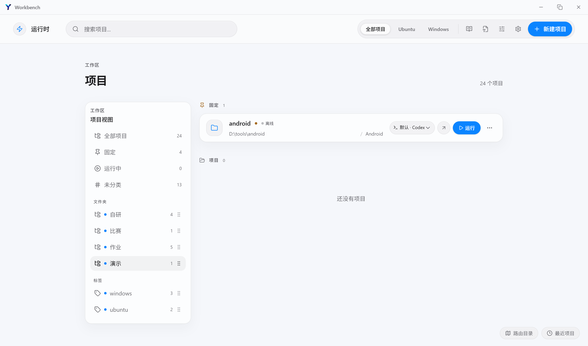
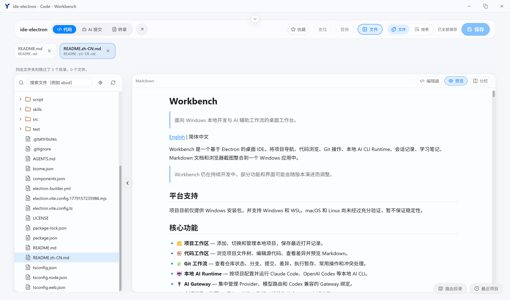
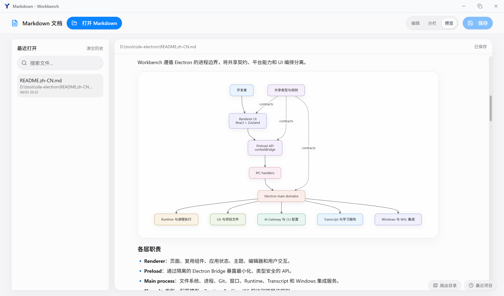

# Workbench

> 面向 Windows 本地开发与 AI 辅助工作流的桌面工作台。

[English](./README.md) | 简体中文

Workbench 是一个基于 Electron 的本地优先开发工作台，将项目导航、代码浏览与编辑、Git 操作、终端管理、本地 AI CLI Runtime、AI Gateway、会话记录、学习笔记、Markdown 文档和浏览器截图整合到一个 Windows 应用中。

Workbench 以“项目”为开发上下文，把代码、终端、Git、AI 会话和文档连接起来，帮助开发者减少工具切换，保留 AI 辅助开发过程中的完整上下文。

> Workbench 仍在持续开发中，部分功能和界面可能会随版本演进而调整。

## 平台支持

项目目前仅提供 Windows 安装包，并支持 Windows 和 WSL。macOS 和 Linux 尚未经过充分验证，暂不保证稳定性。

## 核心功能

- 🗂️ **项目工作区** — 添加、切换和管理本地项目，保存最近打开记录。
- 🧭 **代码工作区** — 浏览项目文件树，使用 Monaco 编辑源代码，查看差异并预览 Markdown。
- 🌿 **Git 工作流** — 查看仓库状态、分支、提交、差异，执行暂存、常用操作和冲突处理。
- 🖥️ **终端与运行管理** — 基于 node-pty 和 xterm.js 管理交互式终端与项目运行任务。
- 🤖 **本地 AI Runtime** — 按项目配置并运行 Claude Code、OpenAI Codex 等本地 AI CLI。
- 🔌 **AI Gateway** — 统一管理 Provider、模型路由、Gateway 绑定、流式响应和协议兼容。
- 🧾 **Agent Hooks 与 Transcript** — 捕获 Agent 生命周期事件，导入、浏览和整理 AI CLI 会话记录。
- 📚 **学习中心** — 维护结构化笔记、分类、技能和浏览器辅助学习资料。
- 📝 **Markdown 工作区** — 支持 GFM、代码高亮、表格和 Mermaid 图表渲染。
- 📸 **浏览器截图** — 捕获长网页、处理固定元素，并在独立窗口中预览或保存截图。
- 🪟 **Windows 和 WSL 支持** — 在 Runtime 模型中明确区分 Windows Native 和 WSL 项目执行路径。

## 截图







## 架构

Workbench 遵循 Electron 的进程边界，将共享契约、平台能力和 UI 编排分离。

详细的产品模块、分层职责和典型 AI 工作流请参阅[模块与架构说明](./docs/reference/architecture.md)。

### 各层职责

- **Renderer**：页面、复用组件、应用状态、主题、编辑器和用户交互。
- **Preload**：通过隔离的 Electron Bridge 暴露最小化、类型安全的 API。
- **Main process**：文件系统、进程、Git、窗口、Runtime、Transcript 和 Windows 集成服务。
- **Shared**：类型、配置模型、Runtime Profile、IPC 契约和跨层纯规则。

## 技术栈

- **语言**：TypeScript
- **桌面框架**：Electron 42
- **UI**：React 18、React Router、Tailwind CSS
- **构建**：Vite、electron-vite、Electron Builder
- **状态管理**：Zustand
- **代码编辑器**：Monaco Editor
- **终端**：node-pty、xterm.js
- **内容渲染**：React Markdown、remark-gfm、Mermaid、代码高亮
- **AI 集成**：Claude Code、OpenAI Codex CLI 工作流，以及本地模型协议 Gateway
- **测试**：Node.js 内置测试运行器

## 产品模块

Workbench 不是多个独立工具的简单集合，而是围绕项目上下文组织的一套本地开发流程：

```text
项目
 ├── 代码与文件
 ├── Git
 ├── 终端与运行任务
 ├── AI Runtime / AI Gateway
 ├── Agent Hooks / Transcript
 ├── Markdown 文档
 └── 学习资料与浏览器截图
```

模块的详细职责、数据流和边界见 [`docs/reference/architecture.md`](./docs/reference/architecture.md)。

## 环境要求

- Windows 10 或更高版本，推荐 Windows 11
- Node.js 22 LTS 或更高版本
- npm
- Git
- 可选：用于 WSL 项目的可用 WSL 发行版
- 可选：用于 AI Runtime 功能的已安装并完成登录的 AI CLI

内置 Runtime Profile 当前支持：

- [Claude Code](https://www.npmjs.com/package/@anthropic-ai/claude-code)
- [OpenAI Codex CLI](https://www.npmjs.com/package/@openai/codex)

## 安装

```powershell
git clone https://github.com/yyc-labs/ide-electron.git
cd ide-electron
npm install
```

`postinstall` 会为 Electron 重建 `node-pty`。如果安装后终端能力异常，可以手动执行：

```powershell
npm run rebuild:pty
```

需要使用 AI Runtime 时，可以安装对应 CLI：

```powershell
npm install -g @anthropic-ai/claude-code
npm install -g @openai/codex
```

安装后请按照各 CLI 官方文档完成登录和 API 配置。

## 本地开发

启动 Electron 开发环境：

```powershell
npm run dev
```

常用命令：

```powershell
# 文件监听模式
npm run dev:watch

# 类型检查
npm run typecheck

# 样式检查
npm run check:style

# 运行测试
npm test

# 完整验证
npm run verify
```

## 配置说明

Workbench 会在本地保存应用和 Runtime 配置。AI 凭据、Token 和 Provider Secret 应通过应用或对应 CLI 配置，禁止提交到仓库。

Runtime 配置可能包括：

- Windows Native 或 WSL 执行目标
- 项目级 AI Runtime Profile
- Claude 与 Codex 设置
- AI Provider 和模型路由
- 本地 Gateway 设置
- Git 与项目工作区偏好

Workbench 将 Windows Native 和 WSL 视为不同的执行目标。Windows 项目使用 Windows 路径和进程环境，WSL 项目使用对应发行版中的路径和环境；Runtime 不依赖模糊的默认后端猜测。

新增配置项时，请同步维护配置 Schema、持久化逻辑、IPC 契约和 Renderer 使用方。

## 项目结构

```text
.
├── src/core/
│   ├── electron/     # 主进程、preload、IPC、Runtime、Git、文件和窗口
│   ├── renderer/     # React 页面、组件、store、编辑器和样式
│   └── shared/       # 共享类型、规则、Runtime Profile 和 API 契约
├── docs/             # 架构说明、设计计划和发布文档
├── script/           # 开发、发布和自动 Git 脚本
├── test/             # Node.js 测试和测试夹具
├── icon/             # Windows 应用图标
├── electron-builder.yml
├── package.json
└── README.md
```

更完整的模块说明位于 [`docs/reference/architecture.md`](./docs/reference/architecture.md)。

## Windows 构建与发布

构建应用资源：

```powershell
npm run build
```

生成 Windows x64 NSIS 安装包：

```powershell
npm run dist:win
```

构建产物位于 `release/`。版本号、校验和及发布说明请参考 [`docs/release/release-process.md`](./docs/release/release-process.md)。

当前安装包尚未配置 Windows 代码签名证书，安装时可能出现 SmartScreen 或“未知发布者”提示。

## 路线图

详细计划维护在 [`docs/`](./docs/) 中。

- [x] 本地项目与代码工作区
- [x] Git 仓库查看与操作
- [x] Claude 与 Codex Runtime Profile
- [x] AI Provider Gateway 与模型路由
- [x] Transcript 导入与浏览
- [x] 支持 Mermaid 和 GFM 的 Markdown 渲染
- [x] 浏览器截图捕获与查看
- [x] 终端与项目运行任务管理
- [x] Agent Hook Gateway 与 Transcript 导入
- [x] 学习中心与技能管理基础能力
- [ ] 扩展 Windows 之外的平台支持
- [ ] 增加更多 Runtime Provider 和集成
- [ ] 完善发布自动化和分发渠道

## 参与贡献

欢迎提交 Issue、Pull Request 和针对性的改进。

1. Fork 仓库。
2. 创建功能分支。
3. 完成聚焦的代码修改，并在适当时补充测试。
4. 运行相关检查。
5. 提交 Pull Request，并说明背景和验证结果。

```powershell
git checkout -b feature/your-feature
npm run typecheck
npm test
```

修改 Runtime 行为时，请保持 `renderer`、`preload`、`main` 和 `shared` 之间的进程边界，并同时评估 Windows Native 与 WSL 执行路径。

## 安全说明

请勿在 Issue、Pull Request、截图或提交记录中包含 API Key、访问 Token、私人会话记录或其他敏感信息。

涉及安全问题时，请在公开披露漏洞细节前先私下联系维护者。项目面向更广泛的公开发布后，将补充专门的安全策略。

## 许可证

Workbench 使用 [MIT License](./LICENSE) 发布。

Copyright © 2026 YYC Labs.

## 作者

**YYC Labs**

- GitHub: [yyc-labs](https://github.com/yyc-labs)
- QQ group: `1095597870`
