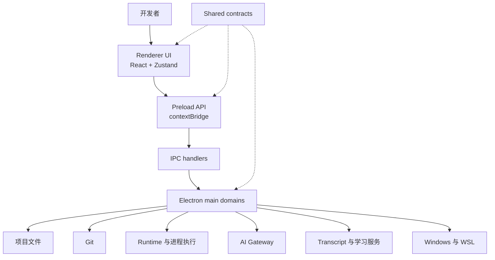

# Workbench 模块与架构说明

Workbench 是一个以本地项目为中心的 Windows 桌面开发工作台。它把代码、Git、终端、AI Runtime、AI 会话、Markdown 文档和学习资料组织在同一个项目上下文中。

## 产品模块

### 项目工作区

项目工作区负责添加、切换和管理本地项目，并保存最近打开记录。项目是 Workbench 中其他能力的上下文边界：代码、Git、终端、Runtime 和 Transcript 都可以关联到当前项目。

### 代码工作区

代码工作区提供项目文件树、文件读取、编辑、保存、差异查看和 Markdown 预览。编辑器基于 Monaco Editor，适合浏览源代码、进行局部修改以及查看 AI 修改后的结果。

### Git 工作流

Git 模块负责读取仓库状态、分支、提交记录、文件差异和冲突信息，并提供暂存及常用操作。Git 能力属于主进程领域服务，Renderer 只消费经过 IPC 契约约束的数据和操作结果。

### 终端与进程运行

终端模块基于 `node-pty` 和 `xterm.js`，为项目提供交互式 Shell 和运行任务能力。主进程负责创建、写入、调整大小、退出和清理伪终端，Renderer 负责终端显示和用户交互。

项目运行时需要明确区分 Windows Native 和 WSL：Windows 项目使用 Windows 路径和进程环境，WSL 项目使用对应发行版中的路径和执行环境。

### AI Runtime

AI Runtime 是 Workbench 的本地 AI CLI 编排模块。它按项目保存 Runtime Profile，负责选择 Provider、执行目标、启动方式和相关参数，并支持 Claude Code、OpenAI Codex CLI 等本地工作流。

### AI Gateway

AI Gateway 为 Provider、模型和 Codex 兼容接口提供统一配置入口。它支持模型路由、Gateway 绑定、流式响应以及重试和协议兼容处理。Runtime 负责运行本地 AI CLI，Gateway 负责统一模型和协议接入。

### Agent Hooks 与 Transcript

Agent Hooks 提供本地 AI 工具事件接入能力。Claude Code 和 Codex CLI 的 Hook 事件经过本地 Gateway 归一化后，通过 Electron 事件转发到 Renderer，用于展示 Agent 生命周期和执行日志。

Transcript 模块负责导入、解析、持久化和浏览 AI 会话记录。外部脚本也可以通过 [Transcript Import API](./hooks/transcript-import-api.md) 将 Markdown、日志、诊断结果或代码审查结果归档到指定项目。

### Markdown 工作区

Markdown 工作区支持 GFM、代码高亮、表格和 Mermaid 图表渲染，并逐步加强与项目文件及系统文件的关联。它既可以作为代码工作区中的预览能力，也可以作为独立的文档沉淀空间。

### 学习中心与浏览器截图

学习中心用于维护结构化笔记、分类、技能和浏览器辅助学习资料。浏览器截图模块支持网页长截图、固定元素处理、元素标记和独立预览，为学习中心和项目文档提供视觉素材来源。

## Electron 分层



### Renderer

Renderer 负责页面路由、复用组件、主题、编辑器、终端显示、应用状态和用户交互。页面按产品领域拆分，跨页面状态以 Zustand Store 为统一来源。

### Preload

Preload 通过 `contextBridge` 暴露最小化、类型安全的 API。它负责组装调用接口和事件订阅，不承载主进程业务逻辑。

### Main process

Main process 承担文件系统、进程、Git、窗口、Runtime、AI Gateway、Transcript、Hook 和 Windows 集成等系统能力。具体能力按 domain 组织，IPC 注册层只负责装配 Handler。

### Shared

Shared 保存跨 Main、Preload 和 Renderer 使用的类型、配置模型、Runtime Profile、IPC 契约和纯规则，避免共享层反向依赖具体运行环境。

## 典型 AI 工作流

```text
选择项目
  -> 配置 Windows Native / WSL Runtime
  -> 启动本地 AI CLI 或 Gateway
  -> 在代码、终端和 Git 中执行开发任务
  -> 通过 Hook 捕获 Agent 生命周期
  -> 导入或查看 Transcript
  -> 将解决方案沉淀到 Markdown 与学习中心
```

## 设计边界

- Renderer 不直接依赖 Electron Main 实现。
- Shared 不依赖 Main、Preload 或 Renderer。
- 系统能力通过 `shared types -> main domain -> IPC -> preload -> renderer` 传递。
- Runtime 行为显式评估 `useWsl` 和项目执行目标。
- AI 凭据和 Provider Secret 通过本地配置管理，不提交到仓库。

## 相关文档

- [Agent Hook Gateway](./hooks/agent-hook-gateway.md)
- [Transcript Import API](./hooks/transcript-import-api.md)
- [发布流程](../release/release-process.md)
